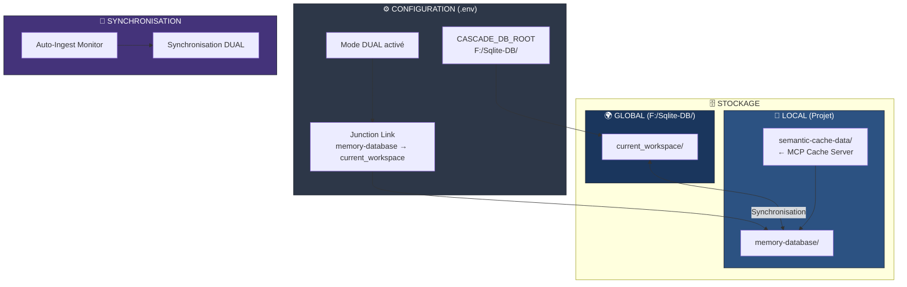
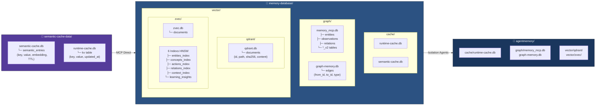
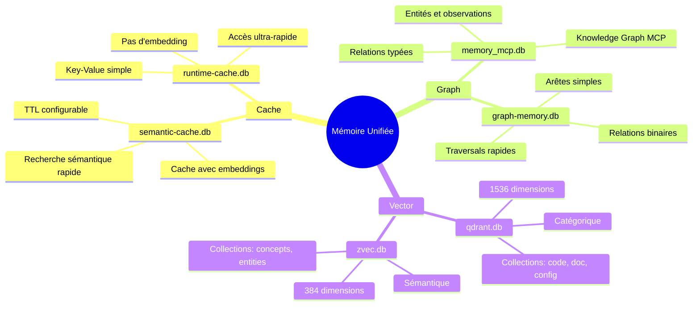
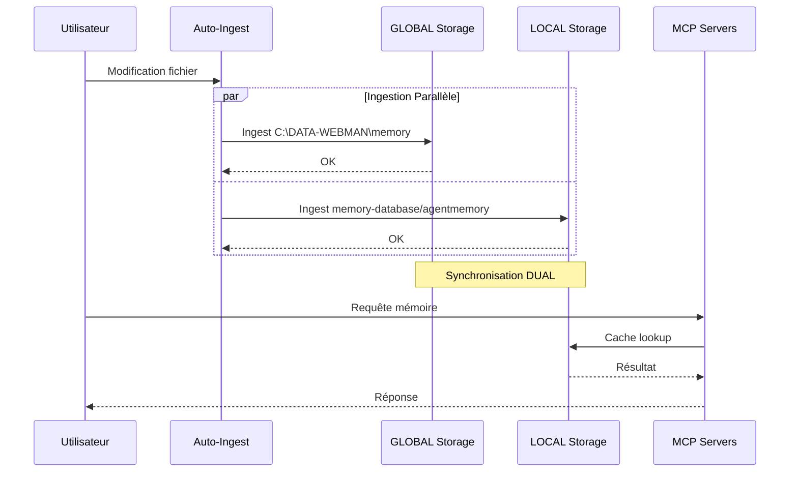
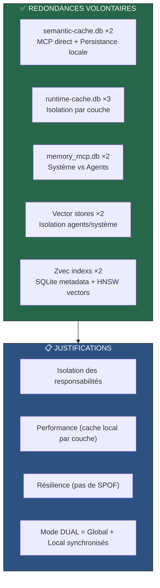
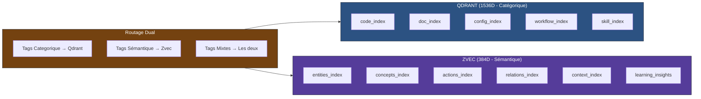

# Analyse de l'Architecture Mémoire Multi-Bases

## 🔍 Vue d'Ensemble

Cette analyse détaille l'architecture de stockage distribuée du système de mémoire unifié.

---

## 1. Architecture Globale - Vue Macro



---

## 2. Structure Détaillée des Bases



---

## 3. Rôle de Chaque Base de Données



---

## 4. Flux de Données - Mode DUAL



---

## 5. Analyse des Redondances



---

## 6. Schéma des Tables SQLite

### Cache Sémantique
```sql
-- semantic-cache.db
CREATE TABLE semantic_entries (
    id INTEGER PRIMARY KEY,
    key TEXT UNIQUE NOT NULL,
    value TEXT NOT NULL,
    embedding BLOB NOT NULL,      -- Vecteur 1536D ou 384D
    created_at INTEGER NOT NULL,
    expires_at INTEGER,           -- TTL
    metadata TEXT                 -- JSON
);
```

### Memory MCP (Knowledge Graph)
```sql
-- memory_mcp.db
CREATE TABLE entities (
    id INTEGER PRIMARY KEY,
    name TEXT UNIQUE NOT NULL,
    entityType TEXT NOT NULL,
    created_at DATETIME
);

CREATE TABLE observations (
    id INTEGER PRIMARY KEY,
    entity_id INTEGER REFERENCES entities(id),
    content TEXT NOT NULL,
    created_at DATETIME
);

CREATE TABLE relations (
    id INTEGER PRIMARY KEY,
    from_entity TEXT NOT NULL,
    to_entity TEXT NOT NULL,
    relationType TEXT NOT NULL,
    UNIQUE(from_entity, to_entity, relationType)
);
```

### Graph Memory (Arêtes)
```sql
-- graph-memory.db
CREATE TABLE edges (
    from_id TEXT NOT NULL,
    to_id TEXT NOT NULL,
    type TEXT NOT NULL,
    created_at TEXT NOT NULL,
    PRIMARY KEY(from_id, to_id, type)
);
```

### Vector Stores
```sql
-- qdrant.db / zvec.db
CREATE TABLE documents (
    id TEXT PRIMARY KEY,
    path TEXT NOT NULL,
    sha256 TEXT NOT NULL,
    content BLOB NOT NULL,
    updated_at TEXT NOT NULL
);

-- zvec/*/metadata.db (par index)
CREATE TABLE config (
    name TEXT NOT NULL,
    dimensions INTEGER NOT NULL,   -- 384 pour zvec
    distance TEXT NOT NULL,        -- Cosine/Euclid/Dot
    enableHybrid INTEGER NOT NULL,
    documentCount INTEGER
);

CREATE TABLE documents (
    doc_id TEXT PRIMARY KEY,
    label INTEGER UNIQUE,
    text TEXT,
    metadata TEXT                  -- JSON
);
```

---

## 7. Collections Vectorielles



---

## 8. Recommandations

### ✅ Optimisations Implémentées

1. **Unification des caches runtime** - RÉALISÉ
   - Cache agentmemory obsolète supprimé (données périmées: 1 fichier vs 150)
   - Architecture réduite de 3 → 2 copies (MCP + Système)
   - Voir: `back-end/README.md`

2. **Clarification graph-memory vs memory_mcp** - DOCUMENTÉ
   - `memory_mcp.db`: Knowledge Graph riche (82 entités, 131 observations, 584 relations)
   - `graph-memory.db`: Graphe de traversal (530 edges simples)
   - Voir: `UNIFIED_MEMORY_SYSTEM.md`

3. **Mode DUAL bien conçu** - La synchronisation Global/Local est appropriée pour le partage multi-projets

### Points Positifs

- ✅ Isolation claire entre agents et système
- ✅ Cache multi-niveaux pour performance
- ✅ Routage dual Qdrant/Zvec pour recherche hybride
- ✅ Knowledge Graph intégré (Memory MCP)
- ✅ Mode DUAL pour partage inter-projets

---

## 9. Conclusion

L'architecture présente des **redondances volontaires et justifiées**:

| Type | Redondance | Nécessité | Statut |
|------|------------|-----------|--------|
| Cache | **SQLite unifié** (cache_table) | **Haute** - Performance et isolation | ✅ Optimisé |
| Graph | 2 copies (complémentaires) | **Moyenne** - Rôles distincts | ✅ Documenté |
| Vector | 2 copies | **Haute** - Routage dual 1536D/384D | ✅ Conservé |

### Données Réelles (après optimisation)

| Base | Entités | Observations | Relations/Edges |
|------|---------|--------------|-----------------|
| memory_mcp.db (système) | 82 | 131 | 584 |
| graph-memory.db (système) | - | - | 530 |
| memory_mcp.db (agents) | 9 | 6 | 500 |
| graph-memory.db (agents) | - | - | 530 |

La synchronisation DUAL-MODE entre stockage global et local est **architecturalement saine** pour un système de mémoire unifié multi-agents.
