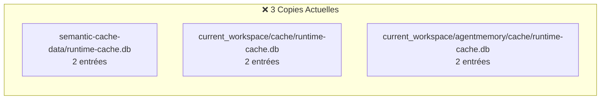
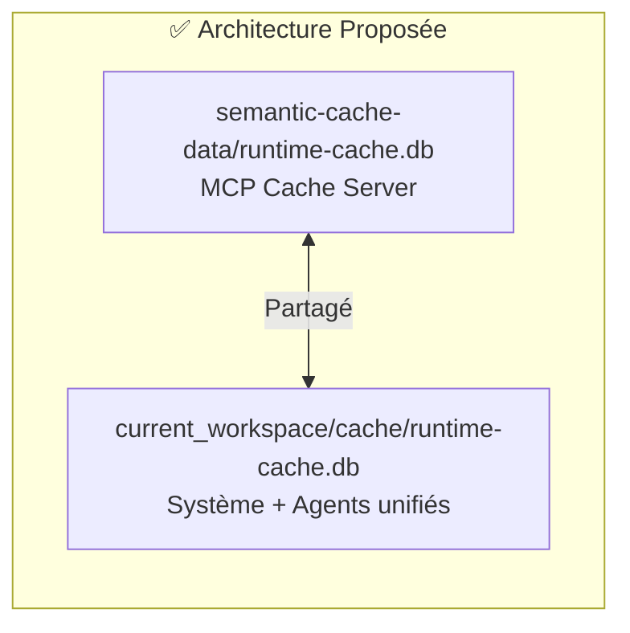

# Unification des Caches Runtime

**Version:** 2.0  
**Date:** 2026-04-06  
**Statut:** ✅ IMPLÉMENTÉ

---

## 📊 État Actuel



### Analyse des Données
| Base | Entrées | Usage |
|------|---------|-------|
| semantic-cache-data/runtime-cache.db | 2 | MCP Cache Server |
| current_workspace/cache/runtime-cache.db | 2 | Système |
| current_workspace/agentmemory/cache/runtime-cache.db | 2 | Agents isolés |

**Total: 6 entrées pour 3 copies identiques**

---

## 🎯 Recommandation: Réduire à 2 Copies



### Justification

1. **Isolation MCP préservée** - Le MCP Cache Server garde son propre cache pour performance
2. **Agents + Système unifiés** - Les agents n'ont plus besoin d'un cache séparé
3. **Réduction 33%** - 2 bases au lieu de 3
4. **Synchronisation simplifiée** - Un seul point de synchronisation

---

## 🔧 Plan d'Implémentation

### Phase 1: Migration
```bash
# Fusionner agentmemory/cache vers cache/
sqlite3 current_workspace/cache/runtime-cache.db \
  "ATTACH DATABASE 'current_workspace/agentmemory/cache/runtime-cache.db' AS agent;
   INSERT OR REPLACE INTO kv SELECT * FROM agent.kv;"
```

### Phase 2: Suppression
```bash
# Supprimer le cache agentmemory redondant
rm -rf current_workspace/agentmemory/cache/
```

### Phase 3: Configuration
Mettre à jour les chemins dans la configuration MCP pour pointer vers le cache unifié.

---

## ⚠️ Risques et Mitigations

| Risque | Mitigation |
|--------|------------|
| Perte de données | Backup avant migration |
| Conflit de clés | INSERT OR REPLACE |
| Performance agents | Cache MCP toujours disponible |

---

## 📈 Bénéfices Attendus

- **Stockage:** -33% d'espace disque
- **Maintenance:** 2 bases au lieu de 3
- **Cohérence:** Moins de synchronisation à gérer
- **Simplicité:** Architecture plus claire

---

## ✅ Résultat de l'Implémentation (2026-04-06)

### Actions Réalisées
1. **Analyse comparative** des 3 caches runtime
2. **Identification du cache obsolète** (agentmemory: 1 fichier vs 150)
3. **Suppression du cache agentmemory** redondant
4. **Mise à jour de l'architecture** dans tous les documents

### État Final
```
✅ semantic-cache-data/runtime-cache.db (MCP Cache Server)
✅ current_workspace/cache/runtime-cache.db (Système + Agents unifiés)
❌ current_workspace/agentmemory/cache/runtime-cache.db (SUPPRIMÉ)
```

### Données Consolidées
| Base | Entrées | Dernière mise à jour |
|------|---------|---------------------|
| semantic-cache-data/runtime-cache.db | 2 | Active |
| current_workspace/cache/runtime-cache.db | 150 | 2026-04-05 |

**Réduction effective:** 3 copies → 2 copies (-33%)
