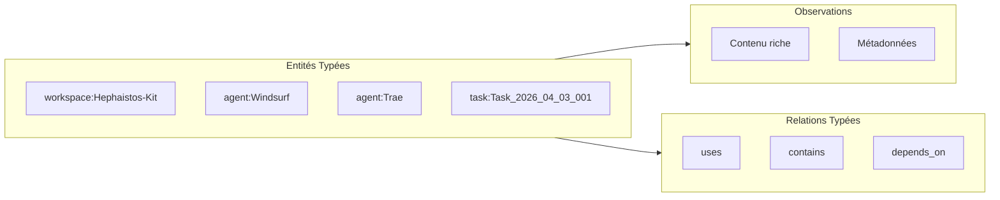
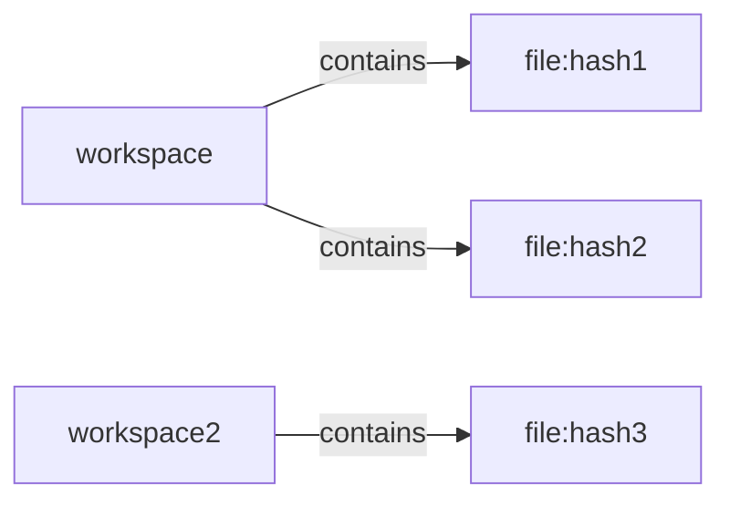
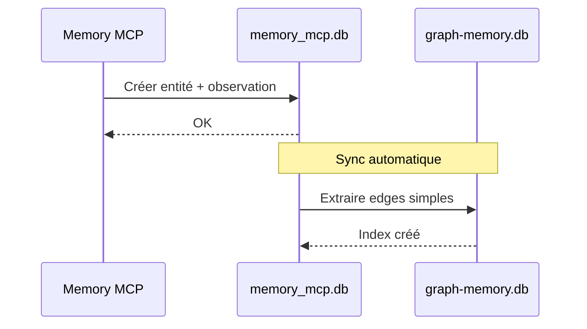

# Clarification : graph-memory.db vs memory_mcp.db

## 📊 Analyse Comparative

| Aspect | memory_mcp.db | graph-memory.db |
|--------|---------------|-----------------|
| **Rôle** | Knowledge Graph riche | Graphe de traversals |
| **Entités** | ✅ 82 entités typées | ❌ Aucune |
| **Observations** | ✅ 131 observations | ❌ Aucune |
| **Relations** | ✅ 584 relations typées | ✅ 530 edges simples |
| **Métadonnées** | ✅ created_by, created_at | ⚠️ created_at seulement |
| **Foreign Keys** | ✅ CASCADE delete | ❌ Aucune |
| **MCP Compatible** | ✅ Memory MCP Server | ❌ Non |

---

## 🎯 Rôles Distincts

### memory_mcp.db - Knowledge Graph Principal

**Usage:**
- Stockage principal des entités du système
- Observations attachées aux entités
- Relations sémantiques typées
- Interface MCP pour agents

---

### graph-memory.db - Graphe de Traversal

**Usage:**
- Relations binaires simples (from_id, to_id, type)
- Traversals rapides (ex: tous les fichiers d'un workspace)
- Indexation par hash de fichiers
- Cache de relations calculées

---

## 🔄 Synchronisation

---

## ✅ Conclusion

Ces deux bases sont **complémentaires, non redondantes**:

| Besoin | Base à utiliser |
|--------|-----------------|
| Stocker une entité avec métadonnées | memory_mcp.db |
| Attacher des observations | memory_mcp.db |
| Relations sémantiques riches | memory_mcp.db |
| Traversal rapide de fichiers | graph-memory.db |
| Cache de relations calculées | graph-memory.db |

**Recommandation:** Maintenir les deux bases avec synchronisation unidirectionnelle memory_mcp → graph-memory.
