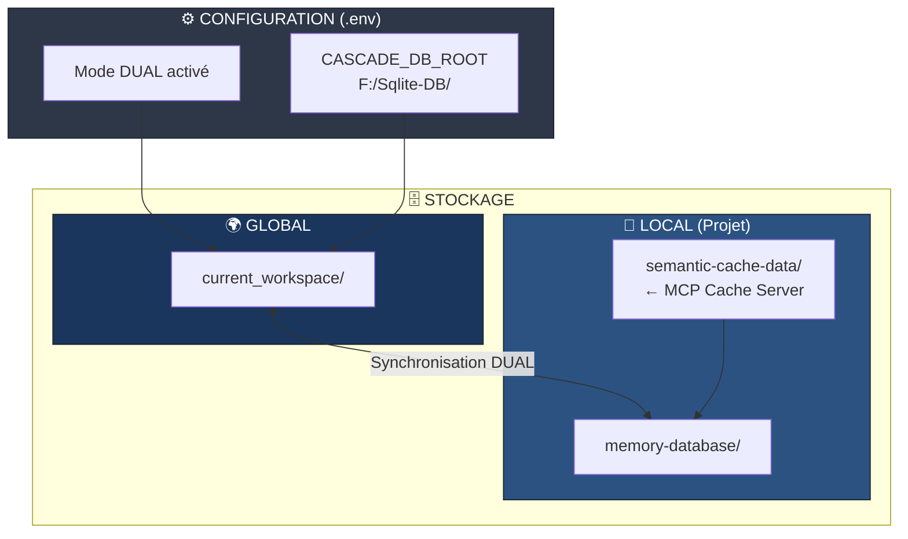
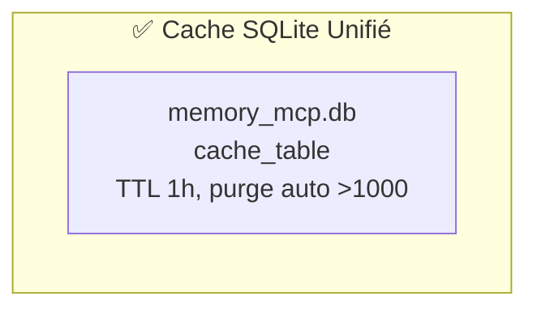
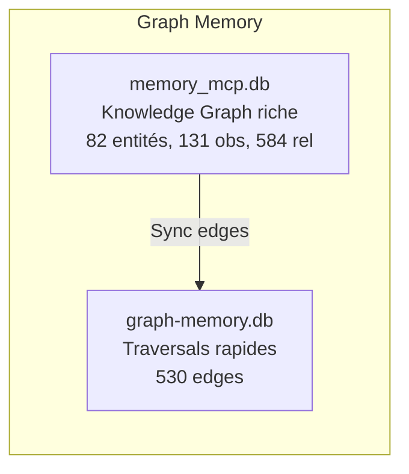

# Système de Mémoire Unifié

**Version:** 2.0  
**Date:** 2026-04-06  
**Statut:** ✅ Optimisé

---

## Architecture Globale



---

## Composants

### 1. Cache System (v2.1 - SQLite Unifié)



| Base | Table | Usage |
|------|-------|-------|
| memory_mcp.db | cache_table | Cache unifié avec trigger purge auto |

**Optimisation:** Serveur cache MCP supprimé → SQLite natif via sqlite-node

### 2. Graph Memory (Complémentaire)



| Base | Rôle | Données |
|------|------|---------|
| **memory_mcp.db** | Knowledge Graph MCP | 82 entités, 131 observations, 584 relations |
| **graph-memory.db** | Traversals | 530 edges simples |

**Documentation:** `GRAPH-MEMORY-CLARIFICATION.md`

### 3. Vector Store (Dual)

| Store | Dimensions | Usage | Collections |
|-------|------------|-------|-------------|
| **Qdrant** | 1536D | Catégorique | code, doc, config, workflow, skill |
| **Zvec** | 384D | Sémantique | entities, concepts, actions, relations, context |

---

## 🧠 DISCIPLINE DE MÉMOIRE UNIFIÉE

### 1. ANCRAGE DU STOCKAGE

**Ordre de détection du mode de stockage :**

1. **Fichier `.env`** → `CASCADE_DB_ROOT=/path/to/db` → Mode global
2. **Variable d'environnement** `CASCADE_DB_ROOT` → Mode global
3. **Sinon** → Mode local

#### Mode LOCAL (par défaut)
```
projet/
└── memory-database/
    ├── cache/
    │   └── runtime-cache.db
    ├── graph/
    │   ├── memory_mcp.db
    │   └── graph-memory.db
    └── vector/
        ├── qdrant/qdrant.db
        └── zvec/zvec.db
```

#### Mode GLOBAL (via .env)
- **Emplacement** : `${CASCADE_DB_ROOT}/current_workspace/`
- **Usage** : Partage de mémoire entre plusieurs projets/agents

### 2. SOURCING SYSTÉMATIQUE
- **AVANT TOUTE TÂCHE** : Utiliser `memory_search()` pour identifier le contexte existant
- **DURÉE DE VIE** : Ne jamais supposer qu'une information est "connue" par défaut

### 3. TRACE DE DÉCISION (ADR)
- **APRÈS TOUTE DÉCISION** : Utiliser `memory_write()` pour documenter chaque choix structurel

---

## Politiques d'Accès

### Lecture
1. Vérifier le cache d'abord
2. Si miss, consulter vector store
3. Mettre à jour le cache avec les résultats

### Écriture
1. Écrire dans la base primaire
2. Invalider le cache concerné
3. Mettre à jour les indexes si nécessaire

### Consolidation
- Quotidienne pour les données anciennes
- Automatique basée sur l'usage
- Manuelle via API d'administration

---

## Sécurité
- Chiffrement des données sensibles
- Contrôle d'accès par rôle
- Audit trail complet
- Backup automatique

---

## Performance
- Latence cible: <100ms (cache), <500ms (vector)
- Disponibilité: 99.9%
- Scalabilité: Horizontale
- Monitoring: Métriques en temps réel

---

## Documents de Référence

| Document | Description |
|----------|-------------|
| `ARCHITECTURE-ANALYSIS.md` | Architecture complète multi-bases |
| `UNIFIED_MEMORY_SYSTEM.md` | Système de mémoire unifié (v2.1) |
| `memory-policy.md` | Politiques de gestion |
| `back-end/README.md` | Archives et historique des changements |
