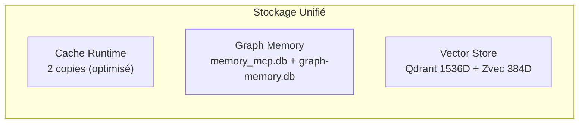

# Processus de Consolidation de Mémoire

**Version:** 2.0  
**Date:** 2026-04-06  
**Statut:** ✅ Optimisé

---

## Objectif
Maintenir la performance et la cohérence du système de mémoire à travers des processus de consolidation réguliers.

---

## Architecture Actuelle



---

## Fréquences

### Quotidienne (02:00 UTC)
- Nettoyage du cache expiré
- Compression des logs
- Statistiques d'utilisation

### Hebdomadaire (Dimanche 03:00 UTC)
- Optimisation des indexes vectoriels
- Consolidation des noeuds graph
- Archivage des données anciennes

### Mensuelle (1er du mois 04:00 UTC)
- Rebuild complet des indexes
- Migration vers nouvelle version si nécessaire
- Backup complet avant maintenance

---

## Processus

### Phase 1: Préparation
```bash
# Vérifier l'état du système
./memory-check --status

# Créer un backup
./memory-backup --full

# Notifier les utilisateurs
./notify --maintenance --in 1h
```

### Phase 2: Consolidation

#### Cache Runtime (v2.0)
```bash
# Cache cleanup - 2 bases au lieu de 3
./cache-cleanup --expired --force

# Bases concernées:
# - semantic-cache-data/runtime-cache.db (MCP)
# - current_workspace/cache/runtime-cache.db (Système)
```

#### Graph Memory
```bash
# Consolidation memory_mcp.db (Knowledge Graph)
./graph-consolidate --merge-duplicates --update-weights

# Sync vers graph-memory.db (Traversals)
./graph-sync --edges-only
```

#### Vector Store
```bash
# Vector optimization
./vector-optimize --rebuild --hnsw

# Qdrant (1536D - Catégorique)
./qdrant-optimize --collections code,doc,config

# Zvec (384D - Sémantique)
./zvec-optimize --collections entities,concepts,actions
```

### Phase 3: Validation
```bash
# Tests d'intégrité
./memory-test --integrity --all

# Performance benchmarks
./memory-benchmark --compare-yesterday

# Rapport de consolidation
./consolidation-report --detailed
```

### Phase 4: Nettoyage
```bash
# Suppression des backups anciens
./cleanup-backups --keep 5

# Rotation des logs
./rotate-logs --compress

# Notification de fin
./notify --maintenance --complete
```

---

## Récupération en Cas d'Échec

### Rollback Automatique
- Détection d'échec pendant consolidation
- Restauration du backup automatique
- Notification immédiate

### Manuel
```bash
# Restauration complète
./memory-restore --backup latest

# Restauration partielle
./memory-restore --table cache --backup 2026-04-01
```

---

## Monitoring Pendant Consolidation
- CPU usage < 80%
- Mémoire disponible > 20%
- Latence < 2x normale
- Erreurs < 0.1%

---

## Statistiques Actuelles

| Composant | Données | Dernière consolidation |
|-----------|---------|------------------------|
| Cache runtime | 152 entrées | 2026-04-05 |
| memory_mcp.db | 82 entités, 131 obs, 584 rel | 2026-04-05 |
| graph-memory.db | 530 edges | 2026-04-05 |
| Qdrant | 5 collections | 2026-04-05 |
| Zvec | 6 indexs | 2026-04-05 |

---

## Documentation
- Logs détaillés dans `${CASCADE_DB_ROOT}/logs/`
- Métriques dans Prometheus
- Alertes configurées dans Grafana

---

## Documents de Référence

| Document | Description |
|----------|-------------|
| `ARCHITECTURE-ANALYSIS.md` | Architecture complète |
| `CACHE-RUNTIME-UNIFICATION.md` | Unification caches |
| `GRAPH-MEMORY-CLARIFICATION.md` | Rôles graph |
| `memory-policy.md` | Politiques |
