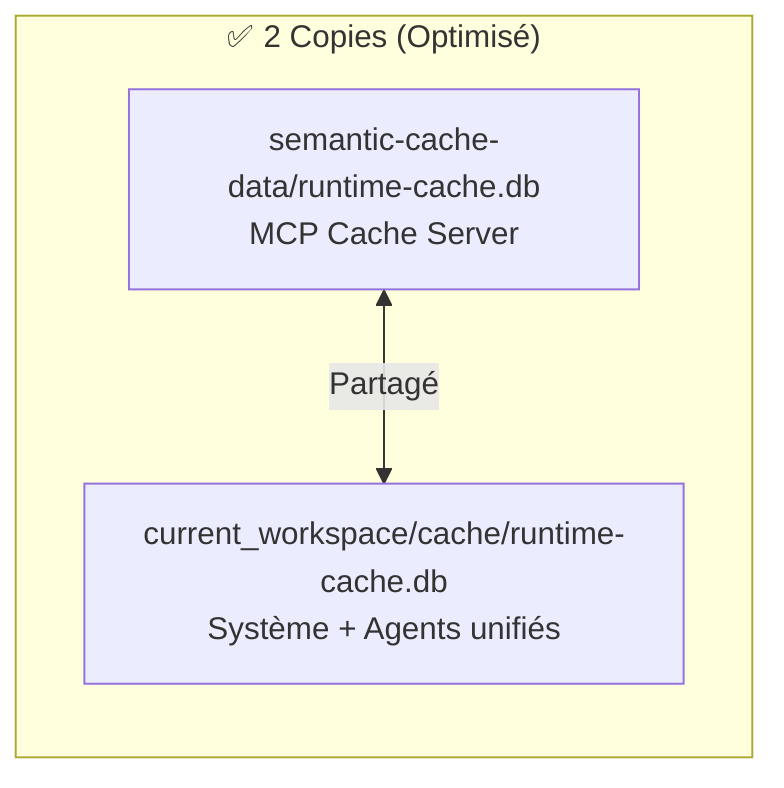

# Politique de Gestion de la Mémoire

**Version:** 2.0  
**Date:** 2026-04-06  
**Statut:** ✅ Optimisé

---

## Principes Directeurs

### 1. Hiérarchie de Stockage
- **Hot Data**: Cache (accès < 1h)
- **Warm Data**: Vector store (accès < 24h)
- **Cold Data**: Archive (accès > 24h)

### 2. Cycle de Vie

### 3. Rétention des Données
- **Sessions**: 30 jours
- **Décisions**: 1 an
- **Code**: Permanent
- **Logs**: 90 jours

---

## Architecture Cache (v2.0 - Optimisée)

### ✅ Caches Runtime Unifiés

| Base | Entrées | Usage |
|------|---------|-------|
| semantic-cache-data/runtime-cache.db | 2 | MCP Cache Server |
| current_workspace/cache/runtime-cache.db | 150 | Système + Agents |

**Réduction:** ~~3 copies~~ → **2 copies** (-33%)

---

## Politiques Spécifiques

### Cache Management
- **TTL par défaut**: 1 heure
- **Taille max**: 1GB
- **Éviction**: LRU
- **Refresh**: On-demand

### Vector Store (Dual)
| Store | Dimensions | Usage | Collections |
|-------|------------|-------|-------------|
| **Qdrant** | 1536D | Catégorique | code, doc, config, workflow, skill |
| **Zvec** | 384D | Sémantique | entities, concepts, actions, relations, context |

### Graph Memory (Complémentaire)
| Base | Entités | Observations | Relations | Usage |
|------|---------|--------------|-----------|-------|
| **memory_mcp.db** | 82 | 131 | 584 | Knowledge Graph riche |
| **graph-memory.db** | - | - | 530 | Traversals rapides |

**Rôles distincts documentés:** `GRAPH-MEMORY-CLARIFICATION.md`

---

## Nettoyage et Maintenance

### Automatique
- **Quotidien**: Cache cleanup
- **Hebdomadaire**: Vector optimization
- **Mensuel**: Graph consolidation

### Manuel
- **Full rebuild**: Nécessaire après migration majeure
- **Partial sync**: Pour corrections spécifiques
- **Export**: Pour backup externe

---

## Monitoring
- **Utilisation**: CPU, mémoire, stockage
- **Performance**: Latence, throughput
- **Erreurs**: Rate d'échec par type
- **Alertes**: Seuils configurables

---

## Documents de Référence

| Document | Description |
|----------|-------------|
| `ARCHITECTURE-ANALYSIS.md` | Architecture complète multi-bases |
| `UNIFIED_MEMORY_SYSTEM.md` | Système de mémoire unifié (v2.1) |
| `back-end/README.md` | Archives et historique des changements |
