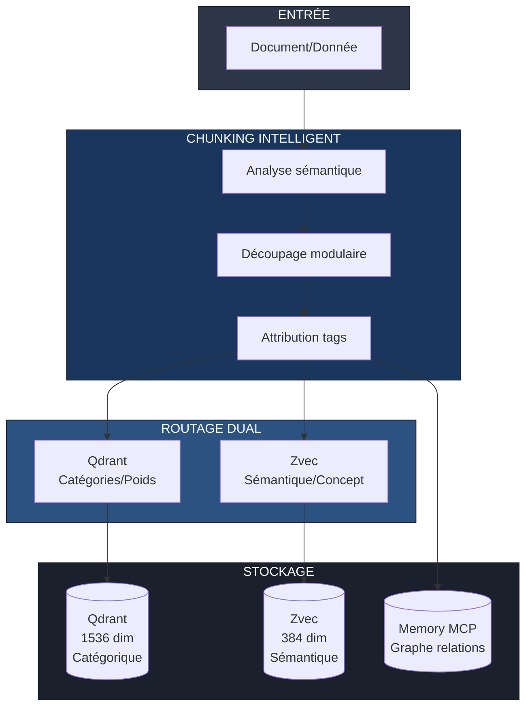
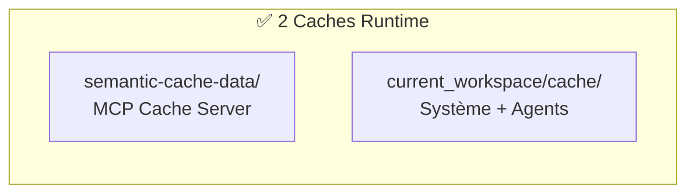
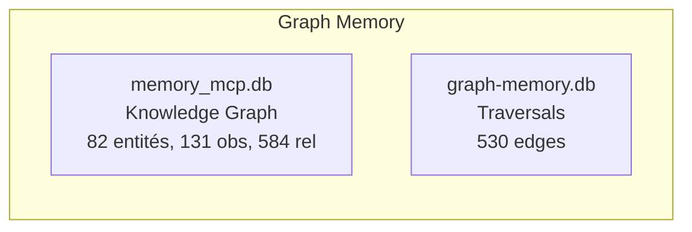
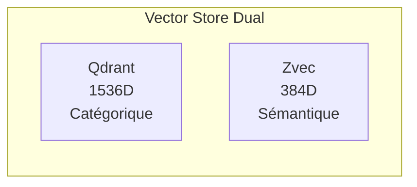
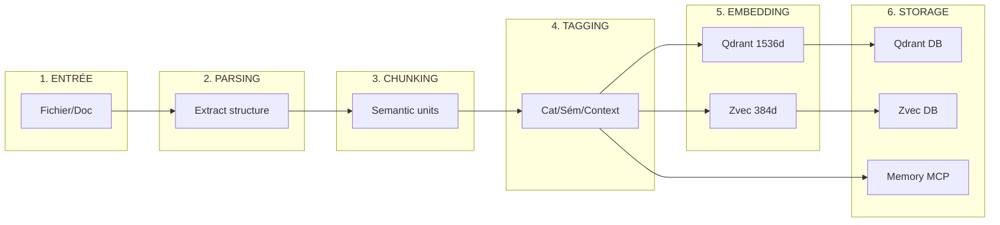

# Architecture RAG Modulaire - Hephaistos-Kit

**Version:** 2.0  
**Date:** 2026-04-06  
**Statut:** ✅ Opérationnel (Score: 100/100)

---

## Vue d'ensemble

Le système RAG utilise deux approches complémentaires pour maximiser la précision de recherche :



---

## 1. Statut du Système (Audit 2026-04-03)

### Score Global: 100/100 ✅

| Indicateur | Valeur | Statut |
|------------|--------|--------|
| **Fichiers Python** | 16 | ✅ |
| **Lignes de code** | 4 642 | ✅ |
| **Classes** | 25 | ✅ |
| **Fonctions** | 125 | ✅ |
| **Erreurs critiques** | 0 | ✅ |

### Modules Implémentés

| Module | Fichier | Classes | Fonctions | Statut |
|--------|---------|---------|----------|--------|
| Chunker | `chunker.py` | 3 | 15 | ✅ |
| Tagger | `tagger.py` | 3 | 12 | ✅ |
| Router | `router.py` | 3 | 10 | ✅ |
| Embedder | `embedder.py` | 3 | 12 | ✅ |
| Fusion | `fusion.py` | 2 | 12 | ✅ |
| Pipeline | `pipeline.py` | 1 | 15 | ✅ |

---

## 2. Architecture Mémoire Intégrée

### 2.1 Cache Runtime (v2.0 - Optimisé)



**Optimisation appliquée:** 3 copies → 2 copies (-33%)

### 2.2 Graph Memory (Complémentaire)



| Base | Rôle | Données |
|------|------|---------|
| **memory_mcp.db** | Knowledge Graph MCP | Entités, observations, relations riches |
| **graph-memory.db** | Traversals rapides | Edges simples (from_id, to_id, type) |

### 2.3 Vector Store (Dual)



---

## 3. Stratégie de Chunking

### 3.1 Types de Chunks

| Type | Taille | Usage | Exemple |
|------|--------|-------|---------|
| **Atomic** | 50-100 tokens | Entités isolées | Variable, fonction, concept |
| **Modular** | 200-500 tokens | Paragraphes cohérents | Documentation, explication |
| **Contextual** | 500-1000 tokens | Sections complètes | Tutoriel, procédure |
| **Structural** | Variable | Code/fichiers | Classes, modules |

### 3.2 Règles de Découpage

1. **Unité sémantique = 1 chunk**
2. **Préserver le contexte**
3. **Chevauchement 10%**
4. **Tags obligatoires**

---

## 4. Système de Tags Unifié

### 4.1 Hiérarchie des Tags

```
TAGS
├── CATÉGORIQUE (Qdrant)
│   ├── type: [code, doc, config, data, log]
│   ├── domain: [frontend, backend, database, devops, security]
│   ├── scope: [project, module, function, variable]
│   └── priority: [critical, high, medium, low]
│
├── SÉMANTIQUE (Zvec)
│   ├── concept: [authentification, cache, api, workflow]
│   ├── action: [create, read, update, delete, validate]
│   ├── entity: [user, project, file, task, agent]
│   └── relation: [depends, implements, extends, contains]
│
└── CONTEXTUEL (Memory MCP)
    ├── temporal: [session, daily, weekly, permanent]
    ├── source: [user, agent, system, external]
    ├── confidence: [high, medium, low]
    └── access: [public, private, restricted]
```

---

## 5. Routage Dual Qdrant/Zvec

### 5.1 Logique de Routage

| Contenu | Tags | Routage |
|---------|------|---------|
| `def authenticate_user()` | type:code, concept:auth | Qdrant + Zvec |
| `Configuration Redis` | type:config, domain:database | Qdrant uniquement |
| `Le chat mange dans sa gamelle` | concept:chat, entity:animal | Zvec uniquement |
| `API endpoint /users` | type:code, scope:api | Qdrant + Zvec |

### 5.2 Collections Vectorielles

#### Qdrant (1536D - Catégorique)
| Collection | Type | Usage |
|------------|------|-------|
| `code_index` | Code | Fonctions, classes, modules |
| `doc_index` | Documentation | README, guides, API docs |
| `config_index` | Configuration | YAML, JSON, ENV |
| `workflow_index` | Workflows | n8n, automations |
| `skill_index` | Skills | Compétences agent |

#### Zvec (384D - Sémantique)
| Collection | Concept | Usage |
|------------|---------|-------|
| `concepts_index` | Concepts | Idées, théories, patterns |
| `entities_index` | Entités | Objets, personnes, projets |
| `actions_index` | Actions | Verbes, opérations |
| `relations_index` | Relations | Liens, dépendances |
| `context_index` | Contexte | Sessions, historique |
| `learning_insights` | Apprentissage | Insights système |

---

## 6. Recherche Hybride

### 6.1 Scoring de Fusion

```python
def hybrid_score(qdrant_score, zvec_score, memory_boost):
    """
    Score combiné pour résultat hybride
    """
    W_CAT = 0.4  # Poids catégorique
    W_SEM = 0.4  # Poids sémantique
    W_MEM = 0.2  # Poids relations
    
    score = (
        W_CAT * qdrant_score +
        W_SEM * zvec_score +
        W_MEM * memory_boost
    )
    
    return min(score, 1.0)
```

### 6.2 Métriques Cibles

| Métrique | Cible | Alerte |
|----------|-------|--------|
| Precision@10 | > 0.85 | < 0.70 |
| Recall@100 | > 0.90 | < 0.75 |
| Latence recherche | < 100ms | > 500ms |
| Couverture tags | > 95% | < 80% |

---

## 7. Pipeline d'Indexation



---

## 8. Configuration

```json
{
  "pipeline": {
    "chunking": {
      "default_size": 300,
      "overlap_percent": 10,
      "min_chunk_size": 50,
      "max_chunk_size": 1000
    },
    "tagging": {
      "auto_detect": true,
      "min_confidence": 0.7,
      "max_tags_per_chunk": 10
    },
    "embedding": {
      "qdrant": {
        "enabled": true,
        "dimensions": 1536,
        "provider": "mistral"
      },
      "zvec": {
        "enabled": true,
        "dimensions": 384,
        "provider": "local"
      }
    },
    "routing": {
      "strategy": "dual",
      "fallback": "both",
      "min_score": 0.5
    }
  }
}
```

---

## 9. Documents de Référence

| Document | Description |
|----------|-------------|
| `ARCHITECTURE-ANALYSIS.md` | Architecture complète multi-bases |
| `CACHE-RUNTIME-UNIFICATION.md` | Unification caches runtime |
| `GRAPH-MEMORY-CLARIFICATION.md` | Rôles graph-memory vs memory_mcp |
| `RAG-AUDIT-REPORT.md` | Audit complet du système RAG |
| `memory-policy.md` | Politiques de gestion |
| `UNIFIED_MEMORY_SYSTEM.md` | Système de mémoire unifié |

---

## Conclusion

Cette architecture RAG modulaire permet :

1. **Chunking intelligent** - Chunks cohérents avec contexte préservé
2. **Tags unifiés** - Classification multi-dimensionnelle
3. **Routage dual** - Qdrant (catégorique) + Zvec (sémantique)
4. **Recherche hybride** - Fusion des deux approches
5. **Intégration mémoire** - Relations dans Memory MCP
6. **Architecture optimisée** - 2 caches runtime, graph complémentaire
