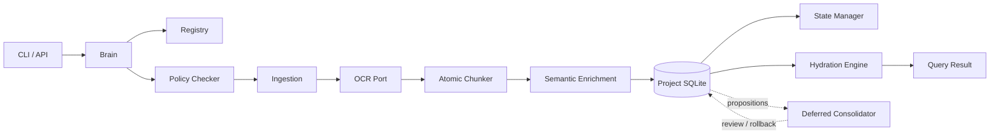

# Carte du système

## Frontières

- Le Brain produit un plan; il n'exécute pas les capacités métier.
- Le Registry décrit les capacités; il ne les orchestre pas.
- Le Policy Checker décide avant l'effet de bord.
- Chaque projet possède sa propre base SQLite, ses documents et ses logs.
- Le Consolidator propose; il ne réécrit jamais silencieusement la connaissance.
